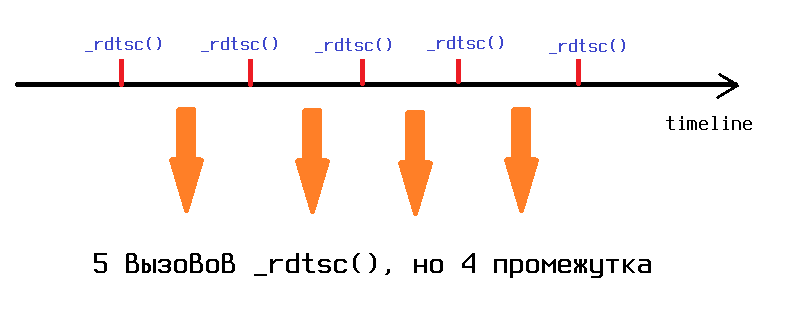
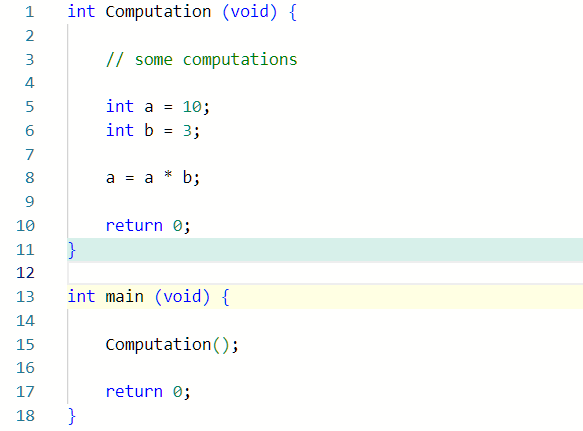
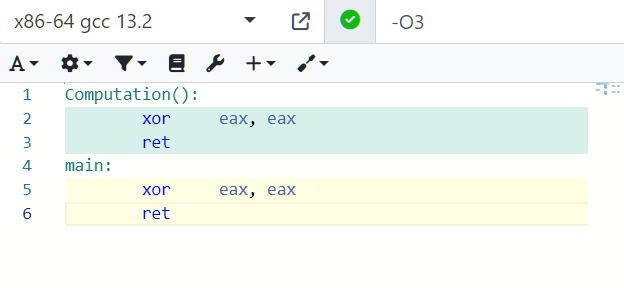
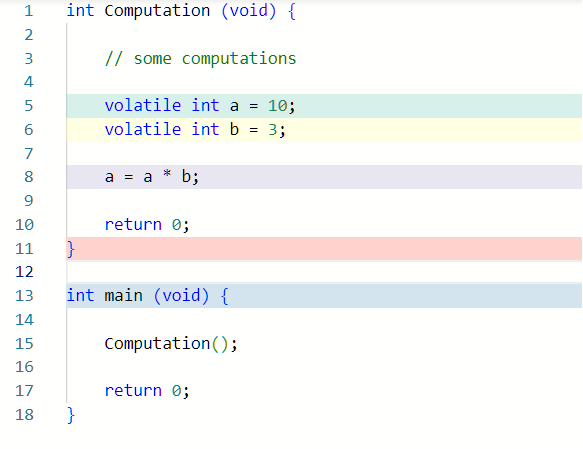
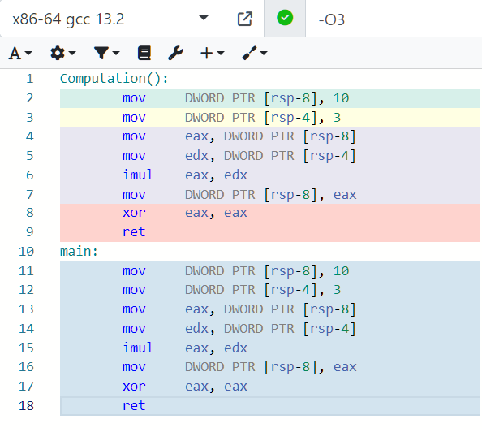
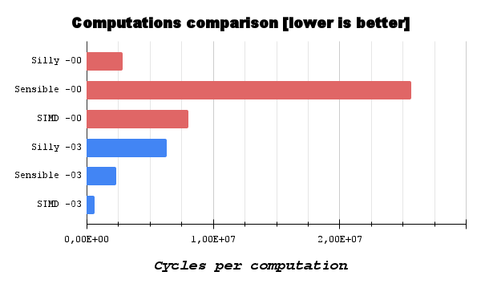

## Множество Мандельброта


### Цель работы
Измерить скорость вычисления множества Мандельброта, используя 3 типа вычислений:
* "глупое" вычисление, считающее цвет одного пикселя за одну итерацию цикла;
* "умное" вычисление, считающее цвет четырех пикселей за одну итерацию цикла;
* вычисление, использующее SIMD.

### Ход работы

#### Вычислительная машина и компилятор
В качестве вычислительной машины для замера производительности использовался ноутбук Toshiba Z930 Portege-DLS, в котором стоит процессор Intel Core i5 3317U архитектуры Ivy Bridge с базовой тактовой частотой 1.7 ГГц (2.6 ГГц в режиме Turbo Boost). 

В качестве компилятора использовался x86-64 gcc версии 13.2.

### Сбор программы
Чтобы собрать программу в обычном режиме, введите  в консоль
```
make
```
Чтобы собрать программу в режиме бенчмарка с флагом компиляции -O0, введите в консоль
```
make benchmark_O0
```
Чтобы собрать программу в режиме бенчмарка с флагом компиляции -O3, введите в консоль
```
make benchmark_O3
```
#### Режимы работы программы 

##### Обычный режим
Выполняется расчет точек множества Мандельброта в цикле, после чего функция `PixelColorSet()` вычисляет цвет каждой точки. На экране выводится изображение множества Мандельброта.

Изображением на экране можно управлять с помощью клавиатуры:

`↑` - сдвинуть картинку вверх;

`↓` - сдвинуть картинку вниз;

`←` - сдвинуть картинку влево;

`→` - сдвинуть картинку вправо;

`F1` - отдалить картинку;

`F2` - приблизить картинку;

`ESC` - выйти из программы.

##### Режим бенчмарка
Расчет точек множества Мандельброта выполняется 1000 раз, при этом расчет цвета каждой точки с помощью функции `PixelColorSet()` не выполняется. Создается текстовый файл, в котором находятся результаты тестирования трех функций по вычислению точек множества Мандельброта.

#### Режим замера производительности (режим BENCHMARK)

##### Параметры тестирования

Тестировать будем с флагом компиляции -O3 и -O0, чтобы выяснить, как влияет оптимизация кода как самим программистом, так и компилятором на скорость вычислений.   

##### Метод измерения производительности

В качестве производительности будем считать количество циклов, необходимых для вычисления 800 * 600 = 480000 пикселей.
Замер производительности будем производить с помощью intrinsic инструкции `_rdtsc()`, которая возвращает значение счетчика TSC (количество тактов с момента последнего сброса процессора). Она будет вызываться до начала вычислений:
```c
#ifdef BENCHMARK
    (config -> benchmark).cycle_start = _rdtsc();

    for (size_t bench_iter = 0; bench_iter < BENCHMARK_COMPUTE_TIMES; bench_iter++) // 1000 computations
#endif
```
и после вычислений:
```c
#ifdef BENCHMARK
    (config -> benchmark).cycle_end = _rdtsc();
#endif
```

##### Насчет `_rdtsc()`

Необходимо сделать отдельную оговорку насчет количества тактов, необходимых для вызова `_rdtsc()`. Напишем функцию `RdtscTest()`, которая будет проводить вычисление количество тактов, необходимых на вызов `_rdtsc()`. Выглядеть она будет так:
```c
const int64_t rdtsc_cycle_start = _rdtsc(); 
                                  _rdtsc();
                                  _rdtsc();
                                  _rdtsc();
const int64_t rdtsc_cycle_end   = _rdtsc();

const double cyc_per_rdtsc = ((double) (rdtsc_cycle_end - rdtsc_cycle_start)) / RDTSC_COMPUTE_NUM;

fprintf (benchmark_res, "Cycles per _rdtsc(): %lg\n", cyc_per_rdtsc);
```
`RDTSC_COMPUTE_NUM` - константа, равная 4. Почему не 5? 

Суть в том, чтобы измерить среднее количество тактов между вызовами `_rdtsc()`. В нашем случае таких промежутков между вызовами не 5, а 4:



 В нашем подсчете тактов, в среднем требуемых на вызов `rdtsc()`, будет создаваться погрешность из-за обращения к переменной `rdtsc_cycle_start` при первом вызове `_rdtsc()`. Даже с такой погрешностью мы получим такие результаты:

 ```
 Cycles per _rdtsc(): 20.75
 ```

В наших условиях такое количество тактов пренебрежимо мало по сравнению с количеством тактов, необходимых для вычисления 480 тысяч точек множества Мандельброта.

##### Суть volatile переменных в коде

Разберем простой пример, который наглядно демонстрирует суть volatile в этой задаче.

Пусть есть функция `Computation()`, которая выполняет в себе некоторые вычисления:



 Можно заметить, что переменная `a` и `b` после вычислений никак не используются. Компилятор с опцией -03 видит это и убирает вычисления этих переменных: 



Если необходимо измерить время, требуемое для вычислений значений переменных `a` и `b`, следует использовать volatile:



Компилятор не сможет выбросить вычисления volatile переменных, и мы сможем произвести замер времени вычислений:



Возвращаясь к нашей задаче, можно заметить, что в режиме работы BENCHMARK функция `PixelColorSet()` не вызывается, поэтому данные вычислений точек множества Мандельброта никак не используются. Компилятор при использовании флага -O3 видит это и выкидывает код, быстродействие которого надо измерить.

Чтобы избежать выкидывания кода, быстродействие которого мы тестируем, следует использовать ключевое слово volatile для переменных, которые являются аргументами для функции `PixelColorSet()`. Таким образом мы будем замерять именно скорость вычислений точек множества Мандельброта.

### "Глупое" вычисление

В функции "глупого" вычисления (вычисление цвета одного пикселя за раз) используется такой код:
```c
double y_0 = NUM_OFFSET_AXIS_Y_;

for (volatile size_t y_pixel = 0; y_pixel < WINDOW_SIZE_Y; y_pixel++, y_0 += NUM_DELTA_Y_) {
        
    double x_0 = NUM_OFFSET_AXIS_X_;
            
    for (volatile size_t x_pixel = 0; x_pixel < WINDOW_SIZE_X; x_pixel++, x_0 += NUM_DELTA_X_) {

        double x = x_0;
        double y = y_0;

        volatile size_t iter_num = 0;

        for (; iter_num <= MAX_COMPUTATION_NUM; iter_num++) {

            double curr_x_sq = x * x;
            double curr_y_sq = y * y;
            double curr_xy   = x * y;

            if ((curr_x_sq + curr_y_sq) > MANDELBROT_RADIUS_SQUARE)
                break;
 
            x = curr_x_sq - curr_y_sq + x_0;
            y = 2 * curr_xy           + y_0; 
        }
    }
}
```

При опции компилятора -O3 такое вычисление среди трех тестируемых является самым неэффективным, так как во внутреннем цикле рассчитывается только одна точка.

Результаты бенчмарка при -O3:
```
Benchmark results for silly no SIMD computations:
Computations repeated 1000 times,
Initial CPU cycle:          27595016925760
End CPU cycle:              27597845576801
Cycles to compute all:      2828651041
Cycles per one computation: 2.82865e+06
```

Результаты бенчмарка при -O0:
```
Benchmark results for silly no SIMD computations:
Computations repeated 1000 times,
Initial CPU cycle:          27409630594756
End CPU cycle:              27415974004703
Cycles to compute all:      6343409947
Cycles per one computation: 6.34341e+06
```

### "Умное" вычисление

Код умного вычисления:

```c
double y_0[ACCUM_NUM] = {NUM_OFFSET_AXIS_Y_, NUM_OFFSET_AXIS_Y_,
                            NUM_OFFSET_AXIS_Y_, NUM_OFFSET_AXIS_Y_};

for (volatile size_t y_pixel = 0; y_pixel < WINDOW_SIZE_Y; y_pixel++) {
    
    double x_0[ACCUM_NUM] = {NUM_OFFSET_AXIS_X_,                    
                                NUM_OFFSET_AXIS_X_ + NUM_DELTA_X_, 
                                NUM_OFFSET_AXIS_X_ + NUM_DELTA_X_ * 2, 
                                NUM_OFFSET_AXIS_X_ + NUM_DELTA_X_ * 3};
        
    for (volatile size_t x_pixel = 0; x_pixel < WINDOW_SIZE_X; x_pixel += ACCUM_NUM) {

        double x[ACCUM_NUM] = {};
        double y[ACCUM_NUM] = {};

        FOR_ACCUM
            x[i] = x_0[i];

        FOR_ACCUM
            y[i] = y_0[i];

        int is_dot_in[ACCUM_NUM] = {};

        FOR_ACCUM
            is_dot_in[i] = 1;

        volatile size_t iter_num[ACCUM_NUM]  = {};

        for (size_t curr_iter = 0; curr_iter <= MAX_COMPUTATION_NUM; curr_iter++) {
            
            double curr_x_sq[ACCUM_NUM] = {};
            double curr_y_sq[ACCUM_NUM] = {};
            double curr_xy[ACCUM_NUM]   = {}; 
            double radius_sq[ACCUM_NUM] = {};

            FOR_ACCUM
                curr_x_sq[i] = x[i] * x[i];
            
            FOR_ACCUM
                curr_y_sq[i] = y[i] * y[i];
            
            FOR_ACCUM
                curr_xy[i] = x[i] * y[i];

            FOR_ACCUM
                radius_sq[i] = curr_y_sq[i] + curr_x_sq[i];

            FOR_ACCUM
                if (radius_sq[i] > MANDELBROT_RADIUS_SQUARE)
                    is_dot_in[i] = 0;
            
            int pixel_mask = 0;

            FOR_ACCUM
                pixel_mask |= (is_dot_in[i] << i);

            if (!pixel_mask)
                break;

            FOR_ACCUM
                x[i] = curr_x_sq[i] - curr_y_sq[i] + x_0[i];
            
            FOR_ACCUM
                y[i] = 2 * curr_xy[i] + y_0[i]; 

            FOR_ACCUM
                iter_num[i] += is_dot_in[i];
        }

        FOR_ACCUM
            x_0[i] += NUM_STEP_X_;
    }

    FOR_ACCUM
        y_0[i] += NUM_DELTA_Y_;
}

```
`FOR_ACCUM` - это макрос, который раскрывается в `for (size_t i = 0; i < ACCUM_NUM; i++)`, где ACCUM_NUM - это константа, равная 4.

При -03 такое "умное" вычисление эффективнее "глупого" тем, что при обращении к массиву кэш промахов будет меньше, что ускоряет вычисления. Помимо этого, при использовании флага -O3 при компиляции при операциях с массивами используются векторные инструкции, ускоряющие вычисления.
    
Результаты бенчмарка при -O3:
```
Benchmark results for sensible no SIMD computations:
Computations repeated 1000 times,
Initial CPU cycle:          27597845739183
End CPU cycle:              27600194702948
Cycles to compute all:      2348963765
Cycles per one computation: 2.34896e+06
```

Результаты бенчмарка при -O0:
```
Benchmark results for sensible no SIMD computations:
Computations repeated 1000 times,
Initial CPU cycle:          27415974045909
End CPU cycle:              27441614859887
Cycles to compute all:      25640813978
Cycles per one computation: 2.56408e+07
```

### Вычисление с помощью SIMD
Код такого вычисления:
```c
__m256d y_0 = INTR_OFFSET_AXIS_Y_;

for (volatile size_t y_pixel = 0; y_pixel < WINDOW_SIZE_Y; y_pixel++) {
    
    __m256d x_0 = _mm256_add_pd (INTR_OFFSET_AXIS_X_, _mm256_mul_pd (INTR_DELTA_X_, INTR_0_TO_3));

    for (volatile size_t x_pixel = 0; x_pixel < WINDOW_SIZE_X; x_pixel += ACCUM_NUM) {

        __m256d x = x_0;
        __m256d y = y_0;

        volatile __m256d iter_num = _mm256_setzero_pd();

        for (size_t curr_iter = 0; curr_iter <= MAX_COMPUTATION_NUM; curr_iter++) {
            
            __m256d curr_x_sq      = _mm256_mul_pd (x, x);
            __m256d curr_y_sq      = _mm256_mul_pd (y, y);
            __m256d curr_xy        = _mm256_mul_pd (x, y); 
            __m256d curr_x_sq_y_sq = _mm256_add_pd (curr_x_sq, curr_y_sq);

            __m256d is_dot_in = _mm256_cmp_pd (curr_x_sq_y_sq, INTR_MAND_RAD_SQ, _CMP_LT_OQ);

            if (!_mm256_movemask_pd (is_dot_in))
                break;

            x = _mm256_add_pd (_mm256_sub_pd (curr_x_sq, curr_y_sq),    x_0);      
            y = _mm256_add_pd (_mm256_mul_pd (INTR_CONST_TWO, curr_xy), y_0);

            __m256d sum_mask = _mm256_blendv_pd (_mm256_setzero_pd(), INTR_CONST_ONE, is_dot_in); 
                    iter_num = _mm256_add_pd    (sum_mask, iter_num);
        }

        x_0 = _mm256_add_pd (x_0, INTR_STEP_X_);
    }

    y_0 = _mm256_add_pd (y_0, INTR_DELTA_Y_);
}
```

При таком вычислении почти в каждой арифметической операции используются векторные инструкции. При использовании опции -O3 это позволяет еще больше повысить быстродействие вычислений.

Результаты бенчмарка при -O3:

```
Benchmark results for SIMD computations:
Computations repeated 1000 times,
Initial CPU cycle:          27600194797695
End CPU cycle:              27600810411579
Cycles to compute all:      615613884
Cycles per one computation: 615614
```

Результаты бенчмарка при -O0:

```
Benchmark results for SIMD computations:
Computations repeated 1000 times,
Initial CPU cycle:          27441614901254
End CPU cycle:              27449654483669
Cycles to compute all:      8039582415
Cycles per one computation: 8.03958e+06
```

### Сравнение быстродействий вычислений

Построим диаграмму, наглядно показывающую производительности трех видов вычислений при уровне оптимизации компилятора -O3 и -O0:



Таблица производительности каждого вычисления при использовании опции -O3:

| Тип вычисления  | Производительность |
| :-------------: | :----------------: |
| "глупое"        | 100.0% 			   |
| "умное"         | 133.6%  		   |
| SIMD			  | 408.8%			   |

Таблица производительности каждого вычисления при использовании опции -O0:

| Тип вычисления  | Производительность |
| :-------------: | :----------------: |
| "глупое"        | 100.0% 			   |
| "умное"         | 24.7%    		   |
| SIMD			  | 78.9%			   |


### Вывод

#### При использовании флага компиляции -O3 

Использование SIMD при вычислении множества Мандельброта дало четырехкратный прирост производительности по сравнению с "глупым" вычислением. При том, что уровень оптимизации компилятора установлен в -O3, такой прирост производительности является впечатляющим!  "Умное" вычисление, как и ожидалось, оказывается быстрее "глупого", но не дотягивает до уровня вычисления с использованием SIMD. Использование SIMD позволяет сократить количество обращений к оперативной памяти по сравнению с "умным" вычислением, из-за чего возникает такой прирост.  

#### При использовании флага компиляции -O0

SIMD и "умное" вычисления проигрывают в производительности "глупому" вычислению в связи с тем, что имеют большее количество обращений к памяти в ассемблерном коде. При этом, закономерно, SIMD вычисление обгоняет в скорости "умное" вычисление.

### Автор

Кулагин Сергей, студент 1 курса ФРКТ МФТИ